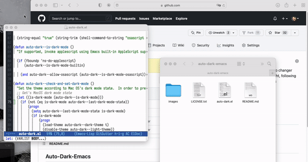

# Auto-Dark for Emacs

[](https://melpa.org/#/auto-dark)

Do you want Emacs to follow your MacOS/Linux/Windows Dark-mode on/off options?

This is it. This program lets Emacs change between 2 user defined (customizable) themes to be automatically changed when Dark Mode set on/off on MacOS/Linux/Windows. Now only supports Gnome on Linux.

By default, themes are _wombat_ and _leuven_, since these are bundled with Emacs.

## Install

Install it from [MELPA](https://melpa.org/#/auto-dark) and add to your `.emacs` file:

```emacs-lisp
(require 'auto-dark)
(auto-dark-mode t)
```

Or simply copy the auto-dark.el file to `~/.emacs.d/auto-dark/auto-dark.el` (or clone this repository there), and then add the following to your `.emacs`:

```emacs-lisp
(add-to-list 'load-path "~/.emacs.d/auto-dark/")
(require 'auto-dark)
(auto-dark-mode t)
```

Or use `use-package` to install:

```emacs-lisp
(use-package auto-dark
  :config (auto-dark-mode t))
```

### Spacemacs

If you use Spacemacs, add `(auto-dark)` to the `dotspacemacs-additional-packages` list and add the following to `dotspacemacs/user-config`:
```emacs-lisp
(use-package auto-dark
  :init (spacemacs/defer-until-after-user-config (lambda () (auto-dark-mode t)))
  :defer t)
```
This ensures that `auto-dark-mode` is activated only after spacemacs's built-in theme loading logic.

## Usage

Change your dark-mode settings on MacOS/Linux/Windows and let the magic happens :D

## Customization

The light/dark themes can be customized using the Emacs customization system. `M-x customize-group auto-dark`.

## OSA Script fallback

For terminal-based emacs, it is possible to check dark mode status using osascript rather than relying on the built-in Applescript support that GUI Emacs provides. To enable it, customize `dark-mode-allow-osascript` and set it to `t`.

## Screenshot

A demo of this package in action.


