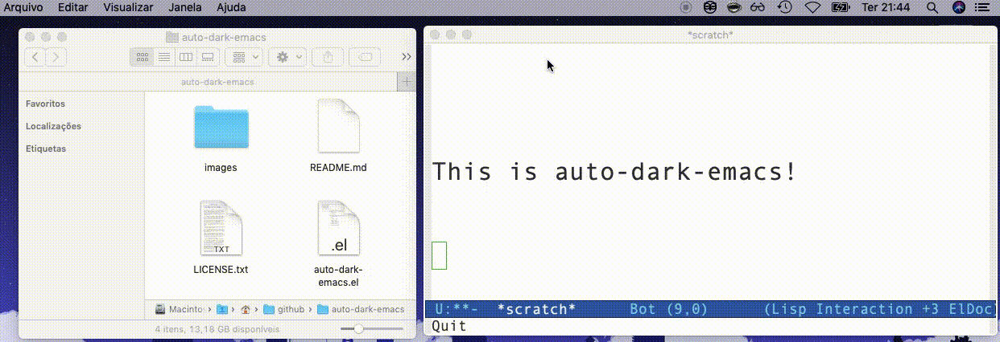

Auto-Dark-Emacs
---------------

Wanna emacs to follow your MacOS Dark-mode on/off options?

That's it. This program lets Emacs change between 2 user defined (in code) themes to be automatically changed when Dark Mode set on/off on MacOS.

By default, themes are wombat and leuven, since these are packed togheter with Emacs.

Install
-------
Simply copy the auto-dark-emacs.el file contents to your ~/.emacs file and restart emacs or eval the dot file.

Usage
-----
Change your dark-mode settings on MacOS and let the magic happens :D

Screenshot
----------
Here it's what it does.

