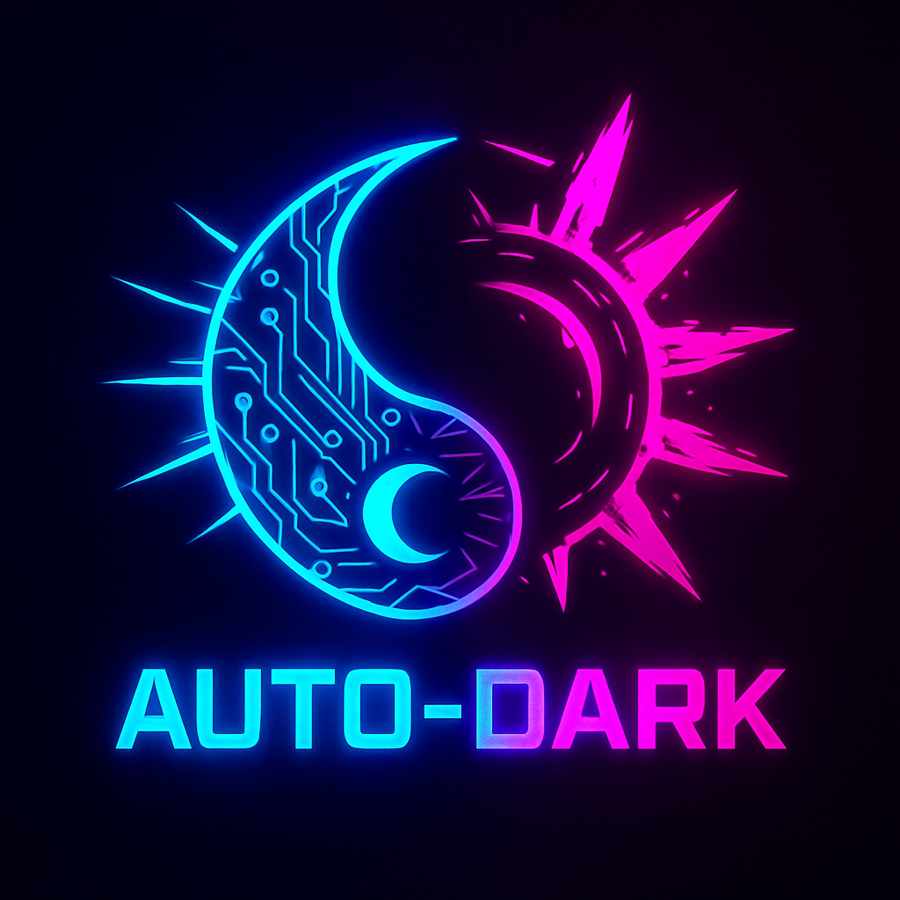
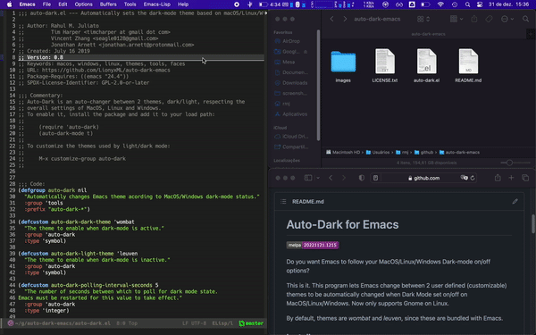
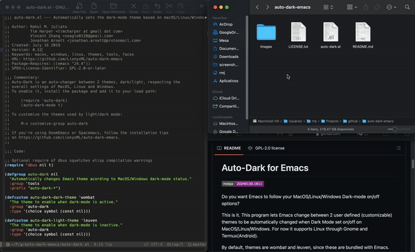

# Auto-Dark for Emacs

<p align="center">
  
</p>

<table align="center">
  <tr>
    <td>
      <a href="https://www.gnu.org/software/emacs/emacs.html">
        
      </a>
    </td>
    <td>
      <a href="https://www.gnu.org/licenses/gpl-3.0.en.html">
        
      </a>
    </td>
    <td>
      <a href="https://melpa.org/#/auto-dark">
        
      </a>
    </td>
    <td>
      <a href="https://stable.melpa.org/#/auto-dark">
        
      </a>
    </td>
  </tr>
</table>

<table align="center">
  <tr>
    <td>
      <h5>Dev: <a href="https://garnix.io/repo/LionyxML/auto-dark-emacs?branch=development">
      
      </a>
      </h5>
    </td>
    <td>
      <h5>Prod: <a href="https://garnix.io/repo/LionyxML/auto-dark-emacs">
      
      </a>
      </h5>
    </td>
  </tr>
</table>

<p align="center">
  Want Emacs to automatically follow your system’s dark mode on macOS, Linux, Windows, or even Android?
</p>

<p align="center">
  <a href="#installation"><strong>Installation</strong></a> ·
  <a href="#settings"><strong>Settings</strong></a> ·
  <a href="#screenshots"><strong>Screenshots</strong></a>
</p>

<hr />

This package, `auto-dark-mode`, introduces a minor mode in Emacs that
enables automatic switching between two user-defined (customizable)
themes. This transition occurs seamlessly in response to Dark Mode
being enabled or disabled across MacOS, Linux, Windows, and Android
platforms.


For now it supports Linux through `dbus` and Android via `Termux`.


## Installation

### Regular Emacs

Install it from [MELPA](https://melpa.org/#/auto-dark) and add to your
`.emacs` or `init.el` file:


```emacs-lisp
(require 'auto-dark)
(auto-dark-mode)
```


Or simply copy the `auto-dark.el` file to
`~/.emacs.d/auto-dark/auto-dark.el` (or clone this repository there),
and then add the following to your `.emacs`:


```emacs-lisp
(add-to-list 'load-path "~/.emacs.d/auto-dark/")
(require 'auto-dark)
(auto-dark-mode)
```

Or use `use-package` to install:


```emacs-lisp
(use-package auto-dark
  :init (auto-dark-mode))
```


### Spacemacs

If you use Spacemacs, add `(auto-dark)` to the
`dotspacemacs-additional-packages` list and add the following to
`dotspacemacs/user-config`:


```emacs-lisp
(use-package auto-dark
  :init (spacemacs/defer-until-after-user-config #'auto-dark-mode)
  :defer t)
```

This ensures that `auto-dark-mode` is activated only after spacemacs's
built-in theme loading logic.


### Doom Emacs

If you use Doom Emacs, load the package in your `packages.el`:
```emacs-lisp
;; In your packages.el
(package! auto-dark)
```

And put the following snippet in your `config.el`:
```emacs-lisp
(use-package! auto-dark
  :defer t
  :init
  ;; Configure themes
  (setq! auto-dark-themes '((doom-solarized-dark) (doom-solarized-light)))
  ;; Disable doom's theme loading mechanism (just to make sure)
  (setq! doom-theme nil)
  ;; Declare that all themes are safe to load.
  ;; Be aware that setting this variable may have security implications if you
  ;; get tricked into loading untrusted themes (via auto-dark-mode or manually).
  ;; See the documentation of custom-safe-themes for details.
  (setq! custom-safe-themes t)
  ;; Enable auto-dark-mode at the right point in time.
  ;; This is inspired by doom-ui.el. Using server-after-make-frame-hook avoids
  ;; issues with an early start of the emacs daemon using systemd, which causes
  ;; problems with the DBus connection that auto-dark mode relies upon.
  (defun my-auto-dark-init-h ()
    (auto-dark-mode)
    (remove-hook 'server-after-make-frame-hook #'my-auto-dark-init-h)
    (remove-hook 'after-init-hook #'my-auto-dark-init-h))
  (let ((hook (if (daemonp)
                  'server-after-make-frame-hook
                'after-init-hook)))
    ;; Depth -95 puts this before doom-init-theme-h, which sounds like a good
    ;; idea, if only for performance reasons.
    (add-hook hook #'my-auto-dark-init-h -95)))
```


## Notes for MacOS users

From the box, this package takes advantage of some built-in functionality found
on the formulaes [Emacs Plus](https://github.com/d12frosted/homebrew-emacs-plus)
and [Emacs Mac](https://github.com/railwaycat/homebrew-emacsmacport?tab=readme-ov-file)
to make detecting switches faster.


If you compiled Emacs yourself or used any other pre-compiled binary,
it is essential to explicitly instruct `auto-dark` you want to use
`Osascript`.


You can do this by adding to your configuration:


```emacs-lisp
(setq auto-dark-allow-osascript t)
```


Doing so will probably make MacOS prompt you for security permissions.
If by any chance it does not prompt you, you can check permissions on MacOS
by going to:


```
Settings -> Privacy & Security -> Emacs -> System Events
```


Also notice if you run emacs from  the terminal, `Osascript` is the only method that
will work.


## Settings

All provided options, including The light/dark themes can be
customized using the Emacs customization system. `M-x customize-group auto-dark RET`.


You can also take advantage of the hooks `auto-dark-dark-mode-hook`
and `auto-dark-light-mode-hook` to make it even further
customizable. Take a look at this article on how to [Integrate
Catppuccin with
Auto-Dark](https://www.rahuljuliato.com/posts/auto-dark-catppuccin).


Following, a complete configuration with all settings set to its defaults:

```emacs-lisp
(use-package auto-dark
  :ensure t
  :custom
  (auto-dark-themes '((wombat) (leuven)))
  (auto-dark-polling-interval-seconds 5)
  (auto-dark-allow-osascript nil)
  (auto-dark-allow-powershell nil)
  ;; (auto-dark-detection-method nil) ;; dangerous to be set manually
  :hook
  (auto-dark-dark-mode
   . (lambda ()
        ;; something to execute when dark mode is detected
        ))
  (auto-dark-light-mode
   . (lambda ()
        ;; something to execute when light mode is detected
        ))
  :init (auto-dark-mode))
```


A short description of each setting:


#### `auto-dark-themes`

A list containing two elements. The first is the list of themes to enable when
dark-mode is active and the second is the list of themes to enable when
dark-mode is inactive.


Possible values for each sublist are themes installed on your system found by
`customize-themes` or `nil` to use Emacs with no themes (default appearance).


If this variable is `nil`, then the set of themes from `custom-enabled-themes`
will be used for both dark and light mode. These themes must support
`frame-background-mode`, or else there will be no visible change.


**NB**: When adding themes to this list, switching between light and dark, or
initializing Emacs, you may see a prompt like “Loading a theme can run Lisp
code. Really load?” If you answer “yes” and allow Emacs to treat the theme as
safe in future sessions, you should only see this prompt once per theme. To
disable the prompt completely, you can set `custom-safe-themes` to `t` before
setting `auto-dark-themes`.


#### `auto-dark-polling-interval-seconds`

The number of seconds between which to poll for dark mode state.
Emacs must be restarted for this value to take effect.


This is here for when there's no emacs-plus (MacOS), or emacs-mac
(MacOS) or a system with dbus or capable of sending events is found, a
timed polling is called to check the current system status.


#### `auto-dark-allow-osascript`

Whether to allow function `auto-dark-mode` to shell out to osascript:
to check dark-mode state, if `ns-do-applescript` or `mac-do-applescript`.


This is only useful for MacOS, please check the section `Notes for
MacOS users` above.


#### `auto-dark-allow-powershell`

Whether to allow function `auto-dark-mode` to shell out to powershell:
to check dark-mode state.


This is only useful for `Windows`. If not set, it will use the built-in Emacs
Windows Registry functions.


#### `auto-dark-dark-mode-hook`

List of hooks to run after dark mode is loaded.


You can use this hook to take leverage of `auto-dark` detection system and
issue more elisp code when some state is detected. You can even use **only** the
hooks by setting the themes to `nil`.


#### `auto-dark-light-mode-hook`

"List of hooks to run after light mode is loaded."


You can use this hook to take leverage of `auto-dark` detection system and
issue more elisp code when some state is detected. You can even use **only** the
hooks by setting the themes to `nil`.


#### `auto-dark-detection-method`

The method auto-dark should use to detect the system theme.


Defaults to nil and will be populated through feature detection
if left as such. Only set this variable if you know what you're
doing!


## Screenshots

This package in action:

- macOS (emacs-plus formulae)



- macOS (emacs-mac formulae)



- Linux (Gnome DE)


